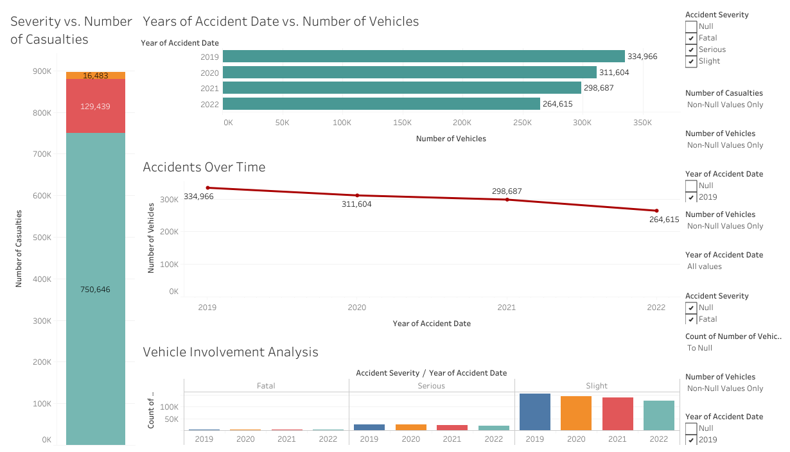

# **Traffic Accident Analysis Dashboard**

## **Overview**
This project presents an interactive Tableau dashboard analyzing traffic accident data. The dashboard provides insights into accident trends, vehicle involvement, and casualty severity, enabling data-driven decision-making for road safety improvements.

## **Objectives**
- Identify trends in accident occurrences over time.
- Analyze the correlation between accident severity and the number of casualties.
- Examine the relationship between the number of vehicles involved and accident frequency.
- Provide actionable insights for policymakers and stakeholders.
- Enhance data-driven decision-making for traffic safety improvements.

## **Dashboard Features**
### **1. Accidents Over Time**
- Visualizes the trend of accidents over different years.
- Helps in understanding whether accident rates are increasing or decreasing over time.
- Assists in recognizing patterns that may influence future safety measures.
- **Image Preview:**  
  

### **2. Severity vs. Number of Casualties**
- Highlights the severity of accidents in relation to the number of casualties.
- Enables the identification of high-risk accident categories.
- Helps stakeholders allocate resources for preventive measures.
- **Image Preview:**  
  

### **3. Years of Accident Date vs. Number of Vehicles**
- Analyzes how the number of vehicles involved changes over time.
- Provides insights into whether multi-vehicle accidents are becoming more frequent.
- Supports authorities in evaluating traffic control measures.
- **Image Preview:**  
  

### **4. Vehicle Involvement Analysis**
- Examines the types and frequency of vehicles involved in accidents.
- Supports understanding of which vehicle categories are most prone to accidents.
- Assists in targeted safety campaigns for high-risk vehicles.
- **Image Preview:**  
  

### **5. Comprehensive Dashboard View**
- Provides an overview of all key insights in a single interactive dashboard.
- Facilitates quick analysis and decision-making.
- Ensures a user-friendly experience for data exploration.
- **Image Preview:**  
  

## **Technology Used**
- **Tableau** – Data visualization and dashboard creation.
- **Data Source** – Traffic accident dataset (structured CSV format).
- **GitHub** – Version control and project collaboration.

## **How to Use**
1. Clone this repository:
   ```bash
   git clone https://github.com/MohamedElmogy25/Accident-Data-Analysis---Tableau-Project/accident-dashboard.git
   ```
2. Download the Tableau workbook (`accident-dashboard.twb`).
3. Open the file using Tableau Desktop.
4. Interact with the dashboard to explore accident trends and insights.
5. Utilize insights to support policy development and accident prevention strategies.

https://public.tableau.com/views/accidentdashboard_17420760588060/Dashboard?:language=en-US&:sid=&:redirect=auth&:display_count=n&:origin=viz_share_link

## **Conclusion**
This dashboard provides a data-driven approach to understanding road accidents, aiding in policy formulation and road safety improvements. The visualizations offer a clear picture of accident patterns, severity, and vehicle involvement over time. By leveraging this analysis, stakeholders can implement more effective safety measures and reduce accident occurrences.
